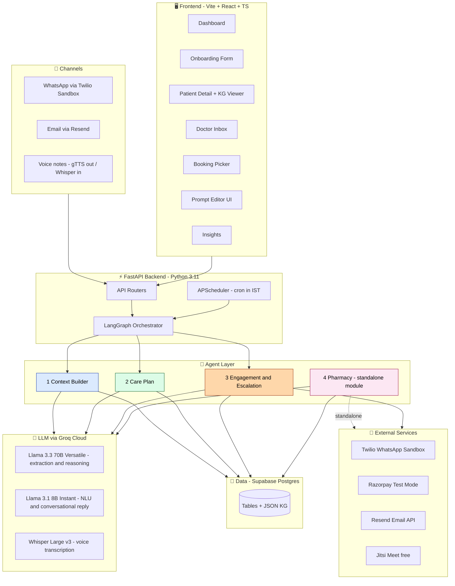
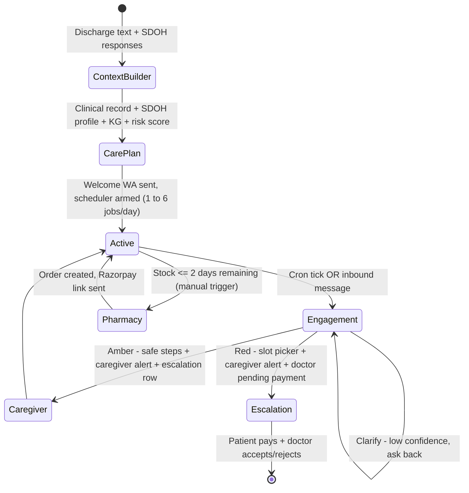
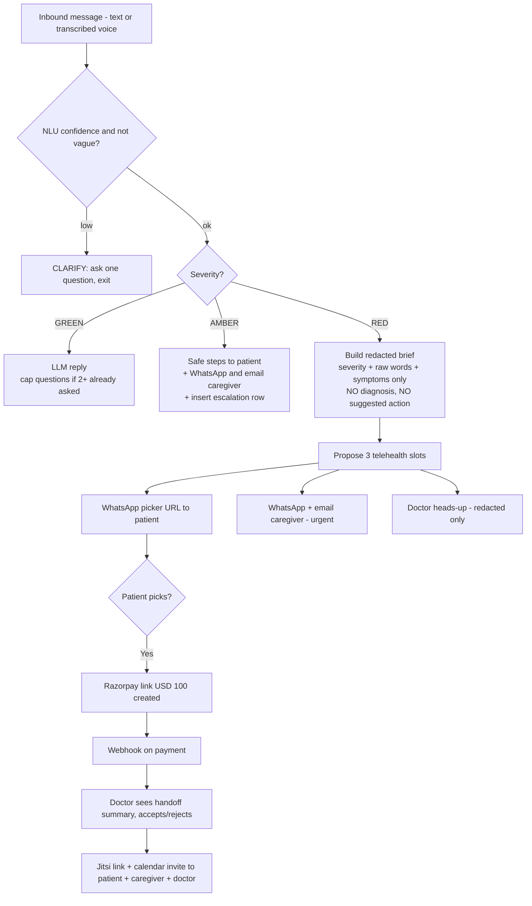
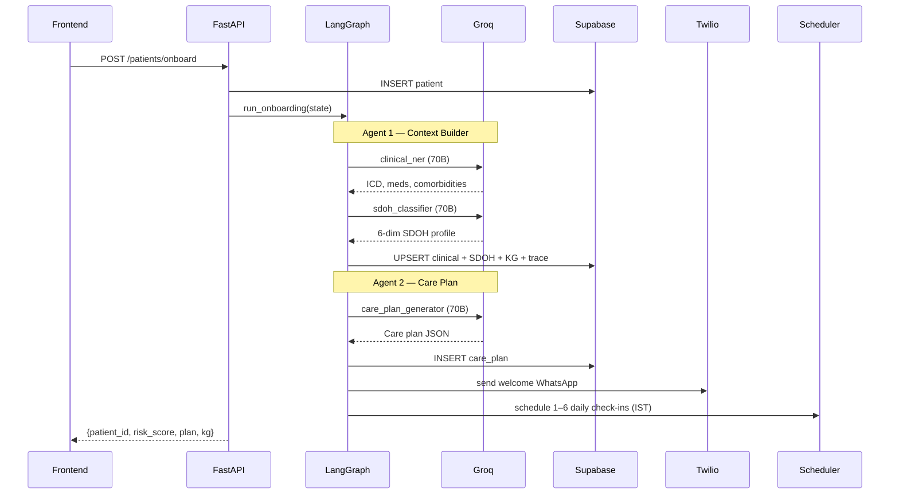
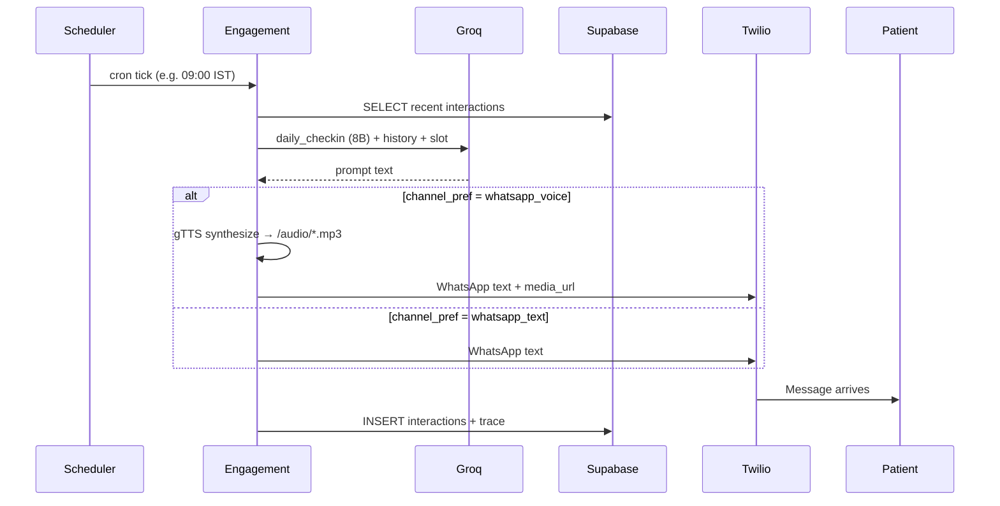
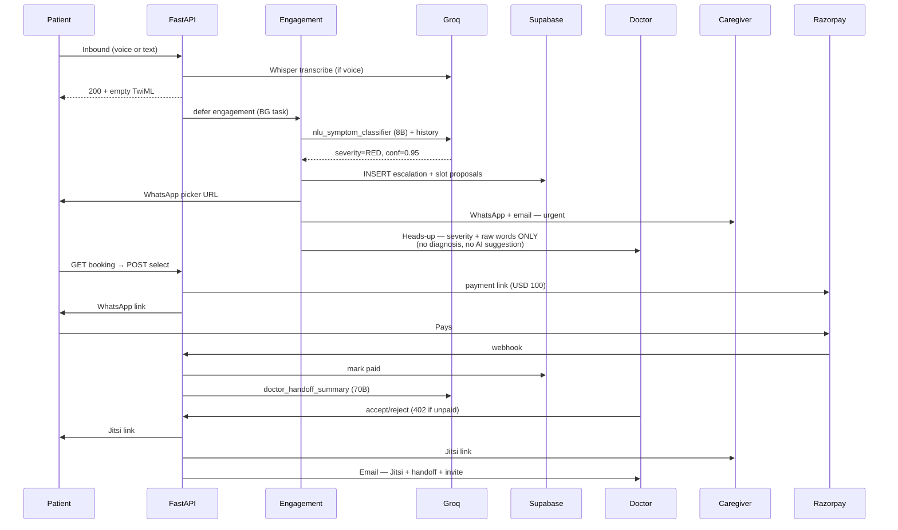
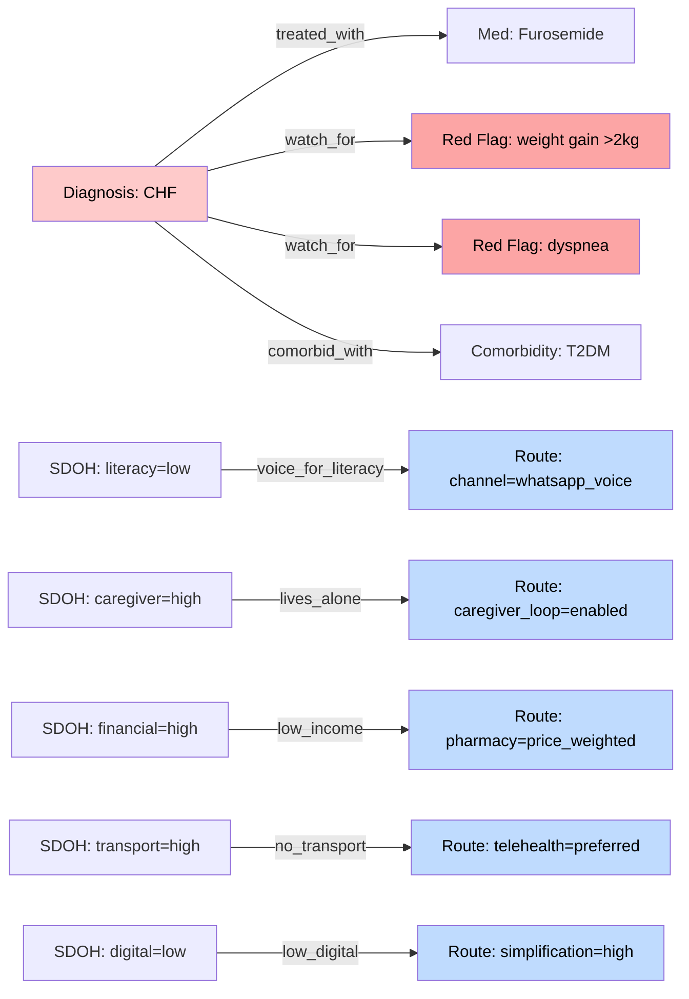

#Demo Video (Full project explanation)

https://drive.google.com/file/d/1JtIIFH4s_BLQ6kWRgeIvlMNtpUmauvZT/view?usp=sharing


# CareLoop

> **An SDOH-aware agentic AI for post-discharge readmission prevention.**

CareLoop monitors patients for **30 days after hospital discharge** — on their phone, through WhatsApp — and routes the right action to the right person at the right time.

It treats **Social Determinants of Health (SDOH)** like literacy, digital comfort, finances, transport, and caregiver presence as first-class routing inputs, alongside the clinical picture. A patient with low literacy receives a voice note instead of a text; a patient who lives alone gets the caregiver looped in automatically — same care plan, different deliveries.

**Live demo:** https://www.careloops.tech
**Docs:** see [`API.md`](./API.md) for the full API reference

---

## What it does

For 30 days after discharge, CareLoop runs an autonomous loop per patient:

- **Onboards** by extracting clinical entities (ICD codes, meds, comorbidities) from a free-text discharge note and classifying SDOH risk across 6 dimensions.
- **Generates** a tailored care plan, sends a welcome WhatsApp + caregiver email, and registers daily APScheduler cron jobs (1–6 check-ins/day).
- **Checks in on schedule** via WhatsApp text or voice (gTTS), referencing the last day or two of conversation so it doesn't ask the same question twice.
- **Triages every reply** with an LLM-based classifier into **Green / Amber / Red / Clarify**, with chat-memory passed in so a "no" answer is read as a denial of yesterday's question, not a new symptom.
- **Escalates Red** by proposing 3 telehealth slots, sending the patient a picker URL, alerting the caregiver, and — only after the patient pays the consult fee — notifying the doctor with a payment-gated AI handoff summary.
- **Persists every reasoning step** (`observed → inferred → decided → tools called`) so the doctor inbox is never a black box.

---

## Diagrams

### 1. System architecture



> Both frontend and backend ship as a **single Docker container** in production: the backend mounts the built Vite bundle and serves it at `/`. API lives at `/api/*`.

### 2. Agent state machine



### 3. The four agents — RED branch decision tree



### 4. Sequence — patient onboarding



### 5. Sequence — daily check-in (cron)



### 6. Sequence — RED escalation with payment gating




### 7. Knowledge graph

CareLoop builds a per-patient `NetworkX DiGraph` with five node kinds and SDOH→route decision edges. The graph is persisted as JSON, rendered in the frontend with `react-force-graph-2d`, and fed back to LLM prompts as `kg_highlights` so the model gets a structured view without re-reading the raw record.



---

## The four agents — at a glance

| # | Agent | Trigger | Key models |
|---|---|---|---|
| 1 | **Context Builder** | `POST /api/patients/onboard` | Llama 3.3 70B for `clinical_ner`, `sdoh_classifier` |
| 2 | **Care Plan** | runs immediately after Agent 1 in the LangGraph DAG | Llama 3.3 70B for `care_plan_generator` |
| 3 | **Engagement & Escalation** | APScheduler cron OR inbound webhook | Llama 3.1 8B for `nlu_symptom_classifier`, `engagement_reply`, `daily_checkin` |
| 4 | **Pharmacy** | standalone module (test/manual) | Llama 3.3 70B for `pharmacy_order` |

A separate **doctor handoff summary** prompt (`doctor_handoff_summary`, 70B) is generated lazily on the booking flow, not by the agents directly.

**Privacy guardrail:** the doctor channel **never** receives an AI-generated diagnosis or suggested clinical action — only severity bucket, the patient's raw words, and the symptom labels NLU pulled out. This is enforced in `_doctor_msg()` / `_doctor_email()` and verified by `test_doctor_message_does_not_leak_diagnosis`.

---

## Tech stack

**Backend** — FastAPI · Python 3.11.9 · LangGraph · NetworkX · APScheduler · gTTS · pytest
**Frontend** — Vite · React 18 · TypeScript · Tailwind · Radix UI · Recharts · `react-force-graph-2d`
**LLM** — Groq Cloud (Llama 3.3 70B Versatile + Llama 3.1 8B Instant + Whisper Large v3)
**Data** — Supabase Postgres
**Channels** — Twilio WhatsApp Sandbox · Resend (email) · Razorpay test mode · Jitsi Meet
**Deploy** — single Docker container on Render free tier (backend serves built frontend)

---

## Setup

### Prerequisites

- Python 3.11.9 · Node.js 18+
- Supabase project (free) · Groq API key (free)
- Optional: Twilio Sandbox creds, Resend API key, Razorpay test keys

### 1. Database

Open Supabase SQL editor → paste `backend/app/db/schema.sql` → run.

### 2. Environment variables

Copy `backend/.env.example` to `backend/.env`. Anything missing flips that integration into mock mode (the demo still works — mocks return realistic payloads).

```ini
# Required for real LLM output
GROQ_API_KEY=gsk_...

# Required for persistence
SUPABASE_URL=https://<project>.supabase.co
SUPABASE_SERVICE_KEY=eyJ...

# Twilio WhatsApp Sandbox (free tier — see "Twilio Sandbox notes" below)
TWILIO_ACCOUNT_SID=AC...
TWILIO_AUTH_TOKEN=...
TWILIO_WHATSAPP_FROM=whatsapp:+14155238886

# Email — Resend HTTP API
RESEND_API_KEY=re_...
EMAIL_FROM="CareLoop Care Team <onboarding@resend.dev>"

# Razorpay (test mode)
RAZORPAY_KEY_ID=rzp_test_...
RAZORPAY_KEY_SECRET=...
RAZORPAY_WEBHOOK_SECRET=...

# Demo defaults
DOCTOR_EMAIL=doctor@example.com
DOCTOR_PHONE=+91...
CAREGIVER_EMAIL_DEFAULT=caregiver@example.com

# Consult fee
CONSULT_FEE=100.0
CONSULT_CURRENCY=USD

# Mock toggles (true = bypass real APIs)
USE_MOCK_WHATSAPP=false
USE_MOCK_EMAIL=false
USE_MOCK_RAZORPAY=false

# Public base URL (set in production)
CARELOOP_PUBLIC_BASE=https://www.careloops.tech
```

### 3. Backend

```bash
cd backend
pip install -r requirements.txt
uvicorn app.main:app --reload --port 8000
```

- Health check: http://localhost:8000/api/healthz
- Swagger docs: http://localhost:8000/docs

### 4. Frontend

```bash
cd frontend
npm install
npm run dev   # http://localhost:3000
```

To point at a different backend during dev:

```bash
VITE_API_BASE=https://your-host npm run dev
```

### 5. Connect the Twilio Sandbox

Twilio Console → Messaging → **Try it out → Send a WhatsApp message**:
- "When a message comes in" → `https://<your-public-host>/api/messages/inbound`
- "Status callback URL" → `https://<your-public-host>/api/messages/status`

Then, from each test phone, WhatsApp the join code (shown in the Twilio console — usually `join <two-words>`) to **+1 415 523 8886** before sending real test messages.

For local dev, expose your port with ngrok: `ngrok http 8000`.

---

## ⚠️ Twilio Sandbox notes (free tier)

CareLoop runs on the **Twilio WhatsApp Sandbox** because the production WhatsApp Business API requires Meta BSP verification, which isn't feasible in a hackathon timeframe.

| Constraint | Impact |
|---|---|
| Sandbox-only sender | All outbound comes from `+1 415 523 8886`. No custom number until BSP verification. |
| Opt-in handshake | Each test phone must WhatsApp `join <two-words>` to the sandbox before it can receive messages. |
| **Daily message limit: 50 / day** | The sandbox is rate-limited to ~50 messages per 24-hour rolling window. Exceeding it returns Twilio error `63038`. The demo is tuned to stay under this — please don't blast the bot during evaluation. |
| 24-hour conversation window | Outside an active 24h window, only pre-approved templates can be sent. Sandbox demos run inside active windows. |

For a real pilot, this all goes away once the project is migrated to a verified BSP number.

---

## Deployment

The repo includes a single multi-stage `Dockerfile` that builds the Vite frontend and bakes it into the backend image. The backend then serves `/` as the SPA and `/api/*` as the REST API.

**Render (one service, free tier):**
1. New → Web Service → connect repo
2. Environment: **Docker**
3. Health check: `/api/healthz`
4. Add env vars from above
5. Set webhooks once deployed:
   - Twilio inbound: `https://<host>/api/messages/inbound`
   - Twilio status: `https://<host>/api/messages/status`
   - Razorpay: `https://<host>/api/razorpay/webhook`

> **Render free tier sleeps** after 15 min idle. First request after sleep takes ~30 seconds. APScheduler jobs are re-armed on startup from `reschedule_active_patients()`.

---

## Tests

```bash
cd backend
pip install -r requirements.txt
pytest -q
```

Three suites in `backend/tests/`:

- `test_smoke.py` — config loads, all 9 prompts parse, KG builds, every external tool returns sane shapes in mock mode, doctor messages don't leak diagnosis, booking flow gates on payment, conversation history is passed to NLU + reply, etc. (~30 tests)
- `test_agents.py` — context builder fuses risk correctly, care plan defaults language and sends welcome, engagement green path doesn't escalate, pharmacy routes to caregiver when `digital_comfort=low`, orchestrator runs onboarding then care plan in order
- `test_handoff_summary.py` — handoff summary fallback when LLM returns empty, partial response normalization, accept blocks unpaid, accept includes summary in email

All tests run with mocks — no real network calls.

---

## Project structure

```
careloop/
├── backend/
│   ├── app/
│   │   ├── agents/         # context_builder, care_plan, engagement, pharmacy, graph, state
│   │   ├── api/            # patients, messages, doctor, booking, prompts, insights, email_preview, razorpay_webhook
│   │   ├── db/             # client + schema.sql
│   │   ├── prompts/        # 9 YAML templates + DB-overridable registry
│   │   ├── scheduler/      # APScheduler jobs (1–6 check-ins/day per patient)
│   │   ├── tools/          # llm, whatsapp, email, voice (gTTS), transcription (Whisper), razorpay, calendar, kg, handoff_summary
│   │   ├── config.py
│   │   └── main.py
│   ├── tests/              # pytest, all-mock
│   └── requirements.txt
├── frontend/
│   ├── src/
│   │   ├── pages/          # Dashboard, Onboard, Patients, PatientDetail, DoctorInbox, EscalationDetail, Insights, Prompts, PatientBooking
│   │   ├── components/     # KGViewer, TriageBadge, EmptyState, forms, layout, ui
│   │   ├── lib/            # api.ts, utils.ts
│   │   └── router.tsx
│   └── package.json
├── docs/
│   └── ARCHITECTURE.md
├── Dockerfile              # Multi-stage: builds frontend, bakes into backend
├── docker-compose.yml
├── render.yaml
├── API.md                  # ← API reference (separate)
└── README.md               # ← you are here
```

---

## Limitations

- **Hackathon demo, not a medical device.** No HIPAA / DPDP compliance, no encryption-at-rest beyond Supabase defaults, no audit logging, no RBAC.
- **Render free tier sleeps** after 15 min idle.
- **APScheduler in-process** — fine for demo; production needs a dedicated worker (Celery, Arq) with a persistent job store.
- **No vector store / no RAG** — clinical knowledge is encoded in prompt templates and a small in-code red-flag dictionary. Enough for a 30-day window.
- **No retraining loop** — doctor accept/reject actions are stored but not yet fed back into prompts.
- **Razorpay test mode** — payment links are real Razorpay test links, not real money.
- **Patient-facing messages are English-only.** Voice notes are routed to low-literacy patients via gTTS, and Whisper transcribes inbound voice; outbound text content itself is generated in English by the LLM prompts.
- **Pharmacy agent** is built and tested but not yet wired into the live cron.

---

## License

MIT — for hackathon use. **Not a medical device. Not for clinical use.**
